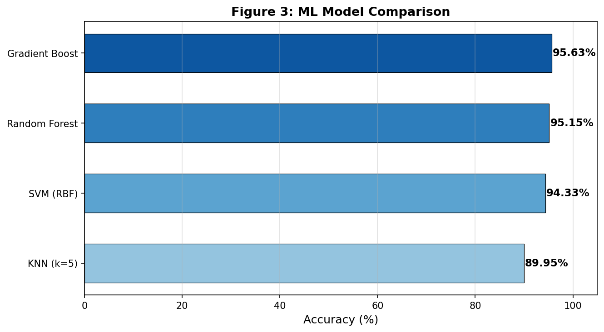
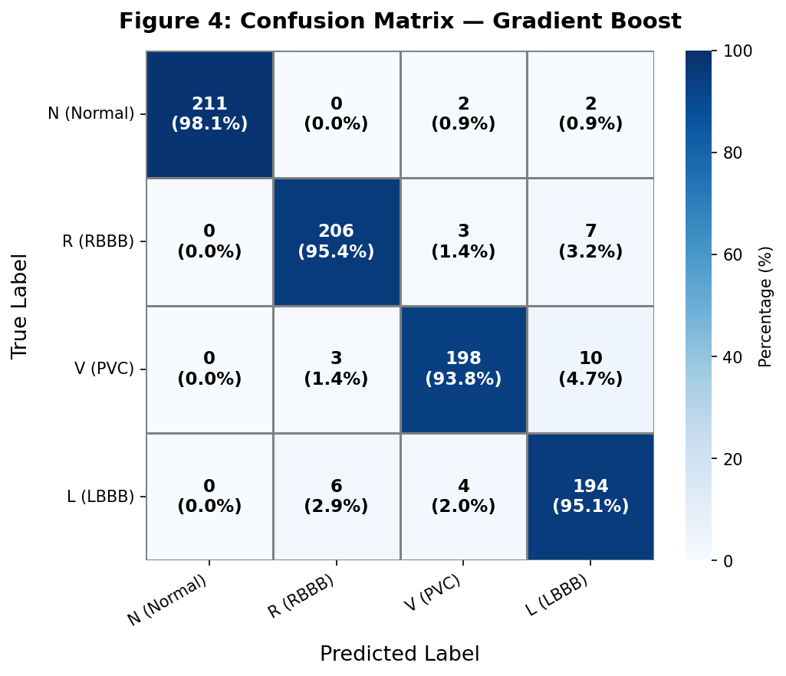
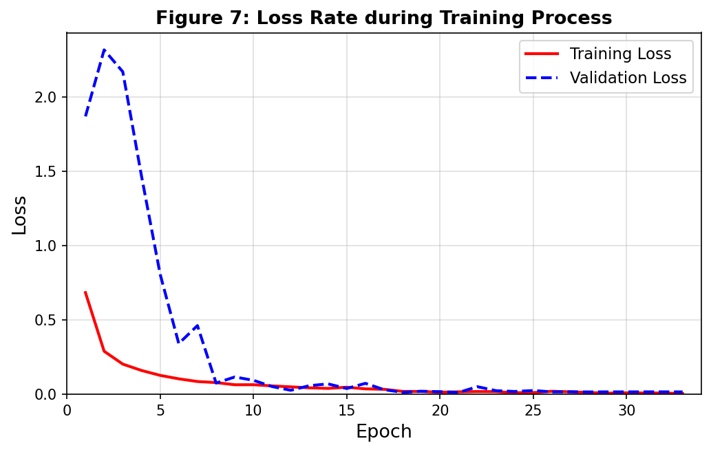
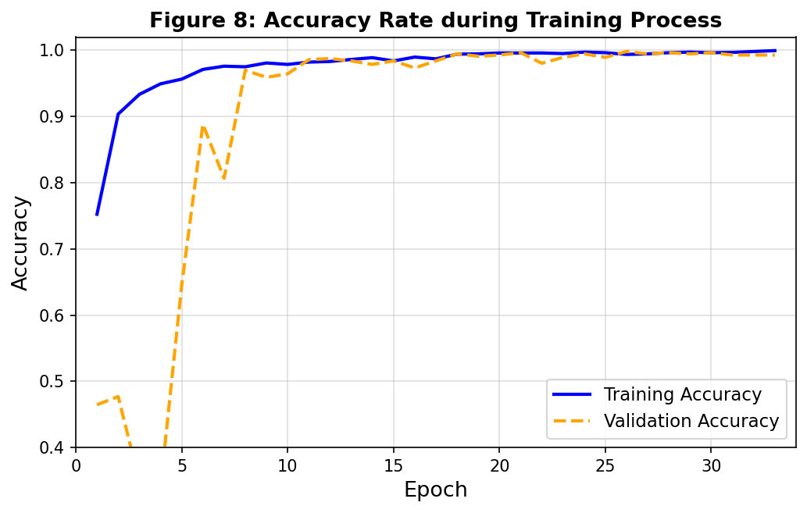
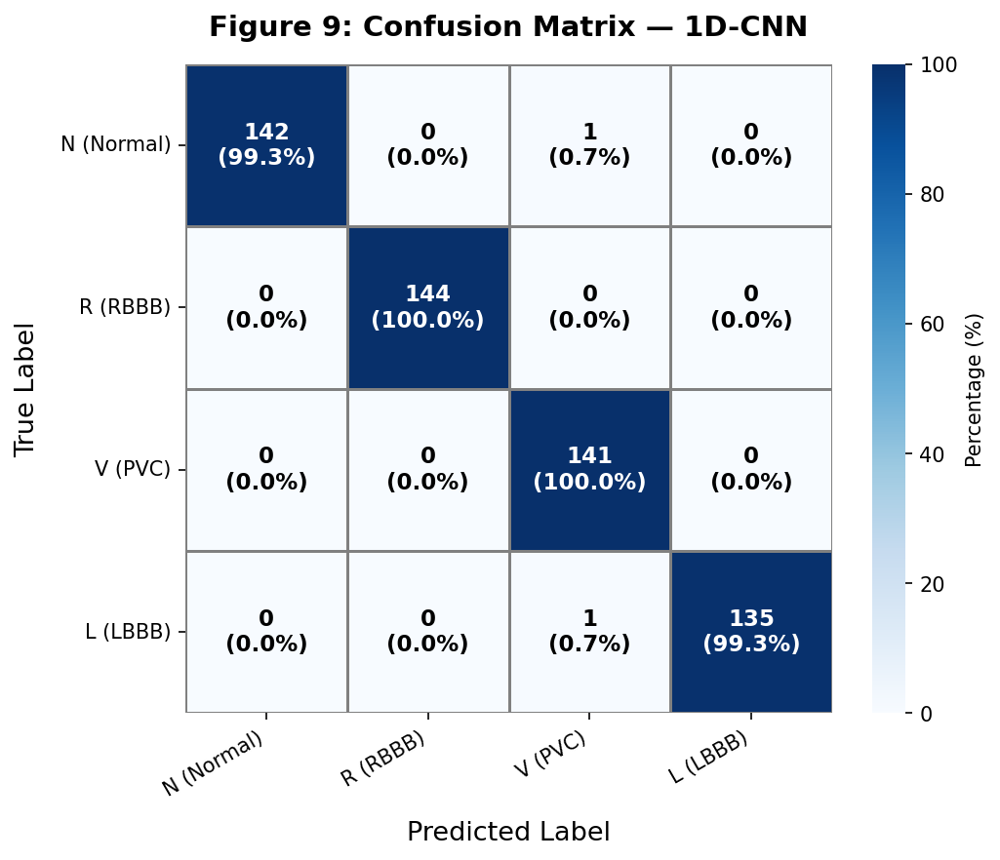
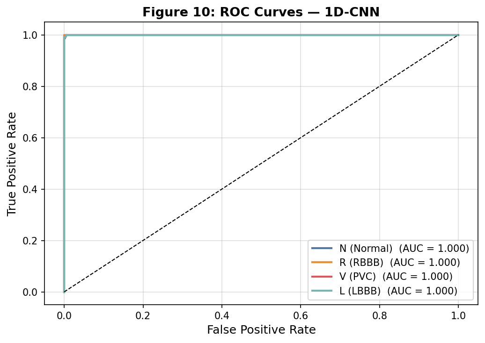
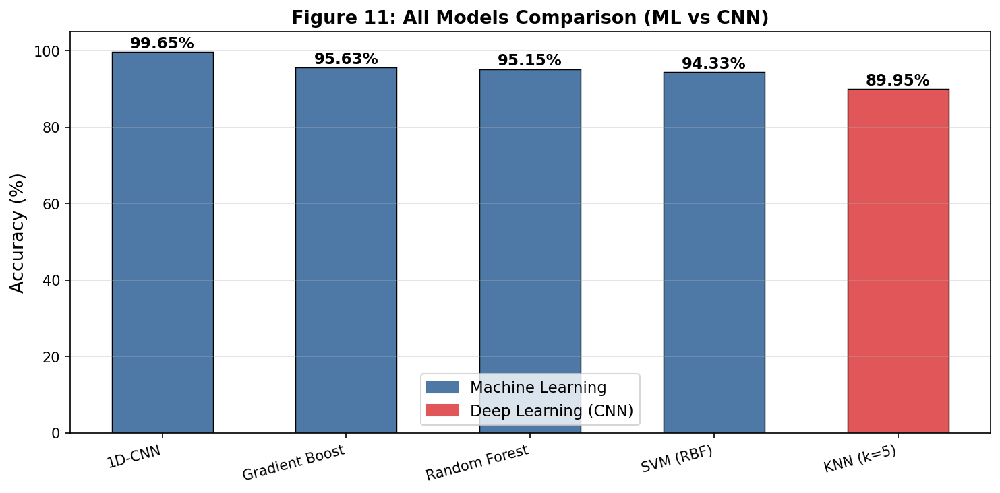

# 🫀 ECG Arrhythmia Classification using CNN

## 📌 Project Overview
This project applies Machine Learning and Deep Learning models to classify ECG signals and detect arrhythmia. A comparison between traditional ML models and a 1D Convolutional Neural Network (CNN) is performed.

---

## 🧠 Models Used
- K-Nearest Neighbors (KNN)
- Support Vector Machine (SVM)
- Random Forest
- Gradient Boosting
- 1D Convolutional Neural Network (CNN)

---

## 📊 Results Summary

| Model | Accuracy (%) | Type |
|------|-------------|------|
| 1D-CNN | **99.65** | Deep Learning |
| Gradient Boost | 95.63 | Machine Learning |
| Random Forest | 95.15 | Machine Learning |
| SVM (RBF) | 94.33 | Machine Learning |
| KNN | 89.95 | Machine Learning |

---

## 🔍 Key Insights
- CNN achieved the highest accuracy (99.65%)
- Deep learning performs better for ECG time-series data
- Traditional ML models require manual feature engineering

---

## 📈 Visual Results

### 📊 Model Comparison (ML Models)


### 🧠 Confusion Matrix (Gradient Boost)


### 📉 CNN Training Loss


### 📈 CNN Training Accuracy


### 🧠 Confusion Matrix (1D-CNN)


### 🎯 ROC Curve (1D-CNN)


### 🏆 Final Model Comparison (ML vs CNN)

---

## 📂 Project Structure
- `cnn-keras-1.ipynb` → Model implementation
- `summary_table.csv` → Model comparison
- `ecg_results/` → Output graphs

---

## 🚀 How to Run
```bash
pip install -r requirements.txt
jupyter notebook